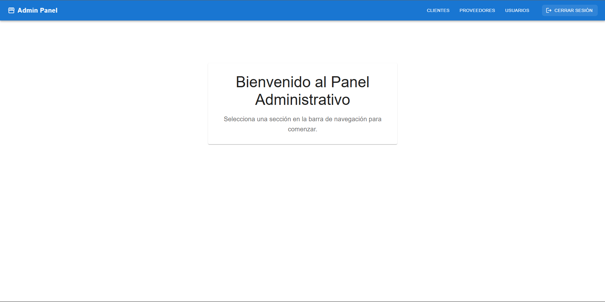

# Panel Administrativo con React

Este proyecto es un panel administrativo web desarrollado con React y Vite, utilizando Material-UI como framework de diseño.

## 📷 Vista panel administrativo sencillo  

*Vista general del panel administrativo web, mostrando la barra de navegación responsiva y el diseño centrado de las secciones.*

## Características

- Navegación moderna con React Router
- Interfaz de usuario construida con Material-UI
- Secciones para gestión de Clientes, Proveedores y Usuarios
- Diseño responsivo y moderno

## Tecnologías Utilizadas

- React
- Vite
- React Router DOM
- Material-UI
- Emotion (para estilos)

## Instalación

1. Clona el repositorio
2. Instala las dependencias:
```bash
npm install
```
3. Inicia el servidor de desarrollo:
```bash
npm run dev
```

## Estructura del Proyecto

```
src/
  ├── components/
  │   └── Navbar.jsx
  ├── pages/
  │   ├── Clientes.jsx
  │   ├── Proveedores.jsx
  │   └── Usuarios.jsx
  ├── App.jsx
  └── main.jsx
```

## Uso

El panel administrativo incluye las siguientes secciones:

- Clientes: Gestión de información de clientes
- Proveedores: Gestión de información de proveedores
- Usuarios: Gestión de usuarios del sistema
- Logout: Cierre de sesión

## Contribución

1. Fork el proyecto
2. Crea una rama para tu feature (`git checkout -b feature/AmazingFeature`)
3. Commit tus cambios (`git commit -m 'Add some AmazingFeature'`)
4. Push a la rama (`git push origin feature/AmazingFeature`)
5. Abre un Pull Request
